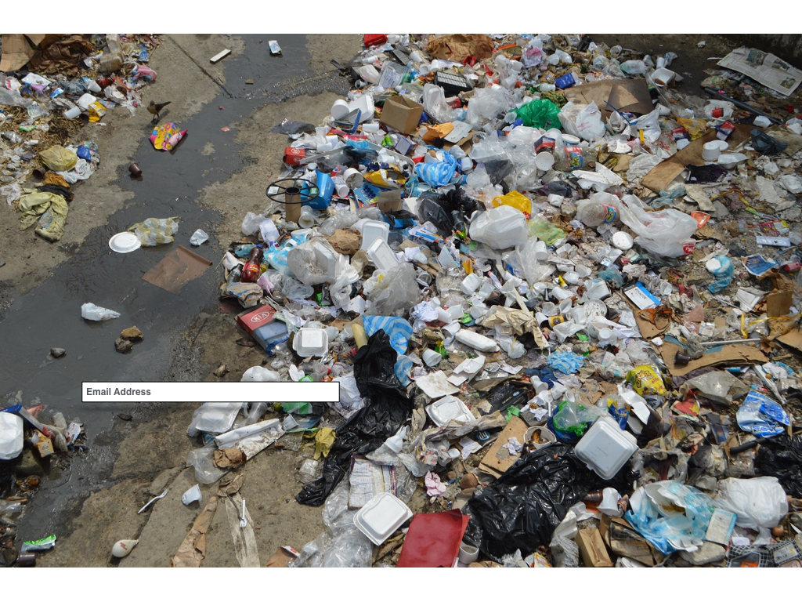

# AB-Test Example
## Introduction
This article is a simple demonstration of the concept AB testing, and how to conduct an AB test using *R*--an open source statistical programming language. Take the common example of a sign-up page for a website. Let's assume that a non-profit company promoting pollution awareness has a website that distributes media and helpful information regarding conservation and combatting pollution. But the company suspects that their sign-up page—where users submit their email address, is not as effective as it could be. So the data scientist at the company decides to test two alternative page designs in an attempt to increase the *conversion rate*, or the proportion of users that enter their email address. During the test period the page will randomly display either the current design, or one of two new designs.  


The current layout (above) is minimalist and consists of a maple leaf on a white background. The data scientist suspects that a depiction of nature or pollution might increase the conversion rate. Viewing what one is interested in preserving (lush nature) or eradicating (pollution) is assumed to strengthen the likelihood of a visitor submitting their email address. 

The 2 new designs are depicted below.




## Simulating Data
Let’s assume that we randomly assign the next 600 visitors to view one of the three versions. The version of the page viewed, along with whether or not they entered their email address are recorded as the raw data for our analysis. 

Now for some code.

The `dplyr` package has a host of functions that are highly useful for manipulating data when using *data frames*, which is what we will use to store our data. 

```
library(dplyr)
```

We begin by simulating 200 observations that are sampled from a binomial distribution using `rbinom`. The mean proportion of 1’s, or conversions, is specified within the distribution. Then a random sample of data is drawn from that distribution. This means that each time the function is called the proportion will most likely differ. But on average, the proportion of 1’s in the sample will equal the proportion that was specified in the `rbinom` call. Data is simulated separately for the 3 groups. The proportions used for each group were selected to make the example interesting, and are not based on data collected in an actual AB test. 

The raw data is converted into a data frame with `data_frame`, and the data are stored into a single column called `signup`. The distributions that we are sampling from have conversion rates, or proportions, of 22%, 28% and 42% for the original, pollution and grassy versions of the sign-up page, respectively.

```
bi_dist_orig <- data_frame(signup=rbinom(200, 1, .22))

bi_dist_pollu <- data_frame(signup=rbinom(200, 1, .28))

bi_dist_grass <- data_frame(signup=rbinom(200, 1, .42))
```

What I’ve done below is hard code the output produced from the first time the code was run. This way the results can be easily replicated for demonstration purposes.

```
bi_dist_orig <- data_frame(signup=c(0,	0,	0,	0,	0,	0,	0,	0,	0,	0,	0,	0,	0,	0,	1,	0,	1,	0,	0,	1,	1,	0,	0,	0,	0,	1,	0,	0,	1,	1,	0,	0,	1,	0,	0,	0,	0,	1,	0,	0,	0,	1,	0,	0,	0,	0,	0,	1,	0,	0,	1,	1,	0,	0,	1,	0,	0,	0,	0,	0,	1,	0,	0,	0,	0,	0,	0,	1,	1,	1,	1,	0,	0,	0,	0,	0,	1,	0,	0,	0,	0,	0,	0,	0,	0,	0,	0,	0,	0,	0,	1,	0,	0,	0,	1,	0,	0,	0,	1,	0,	0,	0,	0,	0,	0,	1,	1,	0,	0,	0,	0,	0,	0,	0,	0,	0,	0,	0,	0,	0,	0,	0,	0,	0,	0,	0,	0,	0,	0,	0,	0,	1,	0,	0,	0,	1,	0,	0,	0,	0,	1,	1,	0,	1,	1,	0,	0,	0,	0,	0,	1,	0,	1,	0,	0,	0,	0,	0,	0,	1,	0,	0,	1,	0,	0,	0,	0,	0,	0,	0,	1,	0,	1,	0,	1,	0,	0,	0,	0,	0,	0,	0,	1,	1,	1,	0,	0,	0,	0,	1,	1,	0,	1,	0,	0,	0,	0,	1,	1,	0))

bi_dist_pollu <- data_frame(signup=c(1,	0,	1,	0,	0,	0,	1,	1,	0,	0,	0,	0,	0,	0,	1,	0,	1,	0,	0,	0,	0,	0,	0,	1,	0,	0,	1,	1,	1,	1,	0,	0,	1,	0,	1,	0,	0,	1,	0,	1,	0,	0,	0,	1,	1,	0,	1,	0,	0,	1,	0,	0,	1,	1,	0,	0,	0,	0,	0,	0,	0,	0,	0,	0,	0,	0,	1,	1,	0,	1,	0,	0,	0,	1,	0,	1,	0,	0,	0,	0,	0,	0,	1,	0,	0,	1,	1,	1,	0,	0,	0,	0,	1,	1,	1,	0,	0,	0,	0,	0,	0,	0,	0,	1,	1,	1,	1,	1,	1,	1,	0,	0,	0,	1,	0,	0,	0,	0,	0,	0,	0,	1,	0,	1,	0,	0,	0,	0,	0,	0,	0,	0,	1,	0,	0,	0,	0,	0,	0,	0,	0,	0,	1,	1,	0,	0,	0,	0,	1,	0,	0,	0,	0,	1,	0,	1,	1,	0,	0,	0,	0,	0,	1,	0,	0,	0,	0,	0,	0,	0,	0,	0,	0,	1,	0,	0,	0,	0,	1,	0,	1,	0,	1,	0,	0,	1,	0,	1,	1,	0,	0,	1,	0,	0,	0,	0,	0,	0,	0,	0))

bi_dist_grass <- data_frame(signup=c(0,	1,	0,	0,	1,	1,	0,	1,	1,	0,	0,	0,	0,	0,	0,	0,	0,	1,	0,	1,	1,	1,	0,	0,	0,	1,	1,	0,	0,	1,	1,	0,	1,	0,	0,	0,	0,	0,	0,	0,	0,	0,	0,	0,	1,	0,	0,	0,	1,	0,	0,	1,	0,	1,	0,	1,	1,	0,	1,	1,	0,	0,	1,	0,	1,	0,	1,	0,	1,	1,	1,	1,	1,	0,	0,	1,	0,	0,	1,	0,	0,	1,	1,	0,	0,	0,	1,	1,	1,	1,	0,	1,	1,	1,	0,	1,	0,	1,	0,	0,	1,	0,	0,	0,	1,	1,	0,	0,	1,	1,	1,	0,	1,	1,	1,	1,	0,	0,	0,	1,	0,	1,	1,	0,	0,	1,	0,	0,	0,	1,	1,	0,	0,	1,	1,	0,	0,	0,	1,	0,	1,	0,	0,	0,	1,	0,	0,	1,	1,	0,	1,	0,	0,	1,	0,	0,	1,	1,	0,	0,	0,	1,	1,	0,	0,	0,	0,	1,	0,	1,	1,	0,	0,	0,	1,	1,	1,	0,	1,	0,	1,	0,	1,	0,	0,	0,	0,	0,	1,	0,	1,	0,	0,	0,	0,	0,	0,	1,	0,	0))
```

But before analyzing the raw data we need to add some additional variables. A new column `pagetype` is created to signify the version of the sign-up page that a user sees, along with two other variables `successes` and `total`, which reflect the raw number of conversions, and the total number of users that viewed that version of the page.  

```
bi_dist_orig$pagetype <- "original"
bi_dist_orig$success <- sum(bi_dist_orig$signup)
bi_dist_orig$total <- nrow(bi_dist_orig)

bi_dist_pollu$pagetype <- "pollution"
bi_dist_pollu$success <- sum(bi_dist_pollu$signup)
bi_dist_pollu$total <- nrow(bi_dist_pollu)

bi_dist_grass$pagetype <- "grass"
bi_dist_grass$success <- sum(bi_dist_grass$signup)
bi_dist_grass$total <- nrow(bi_dist_grass)
```

## Chi-Square Test of Equal Proportions
The data frame `full_data_success_rates` holds the raw number of conversions and the total number of users that viewed each of the 3 page types. The `signup` column is removed because it is no longer needed. 

```
full_data_success_rates <- rbind(bi_dist_orig[1,], bi_dist_grass[1,], bi_dist_pollu[1,]) %>%
  select(-signup)
```

The *Chi Square* is run with `prop.test`, and we are interested in whether the p-value of X-Squared is below 0.05. Statistically, this means that if we are willing to say that the groups differ, we must have 95% certainty (or higher) that they do.  

The proportion estimates are labeled ‘sample estimates’, with prop 1, prop 2 and prop 3 corresponding to the original, grassy and pollution sign-up pages, respectively. The grassy version had the highest conversion rate at 42%, followed by the pollution version with 29.5%, finishing off with the original version that had a 23% conversion rate.  Importantly, the X-squared value is significant (p < 0.0005), meaning that at least one of the three proportions significantly differs from one of the others. 

```
prop.test(full_data_success_rates[[2]], full_data_success_rates[[3]])
```

```
OUTPUT
3-sample test for equality of proportions without continuity correction

data:  full_data_success_rates[[2]] out of full_data_success_rates[[3]]
X-squared = 17.287, df = 2, p-value = 0.0001763
alternative hypothesis: two.sided
sample estimates:
prop 1 prop 2 prop 3 
 0.230  0.420  0.295 
 ```

For plotting purposes all 3 data sets are bound together (by row) into a single data frame.

```
full_data <- rbind(bi_dist_orig, bi_dist_pollu, bi_dist_grass)
```

These data are visualized in the bar graph below, which depicts the proportion of conversions and non-conversions for each version of the sign-up page. The library `ggplot2` is loaded and `full_data` is piped into `ggplot` with `pagetype` and `signup` entered as the x and fill properties of the graph. The `geom_bar` call produces the bar graph and `labs` labels the x and y axes. 

```
library(ggplot2)
full_data %>%
  ggplot(aes(x = as.factor(pagetype), fill = as.factor(signup))) + 
  geom_bar(position = "fill") + 
  scale_fill_brewer(name="Conversion Type", palette="Paired", labels=c("No Conversion","Conversion")) +
  ggtitle("Conversion Rate for Sign-up Pages") + 
  theme(plot.title = element_text(hjust = 0.5)) +
  labs(x = "Sign-up Page Type", y = "Proportion")
```


## Pairwise Comparisons
Despite the different proportions of the 3 groups, we need to confirm which one’s statistically differ by comparing the groups directly with one another. To do this we conduct post-hoc (pairwise) comparisons using ` pairwise.prop.test `, which uses the Holm correction method to account for multiple comparisons. Again, groups 1, 2 and 3 correspond to the original, grass and pollution sign-up pages, respectively. Below we see no difference in conversion rates between the current version (1) and the new version depicting pollution (3). However, the version depicting the grassy park (2) produced significantly more conversions than both the current version (1), and the new version with pollution (3). 

```
multi_comp <- pairwise.prop.test(full_data_success_rates[[2]], full_data_success_rates[[3]])
multi_comp$p.value

```

```
OUTPUT
             1          2
2 0.0002346223         NA
3 0.1726751103 0.02457068
```

## Conclusion
From this the data scientist concludes that the grassy background sign-up page, compared to the other 2 pages, has a significantly higher conversion rate, indicating that the current page should be replaced with the grassy park version. In summary, this was a quick demonstration of how a simple question about user behavior is transformed into an AB test design, and how such analyses are conducted in R to make data-driven decisions about the features of a website. 
